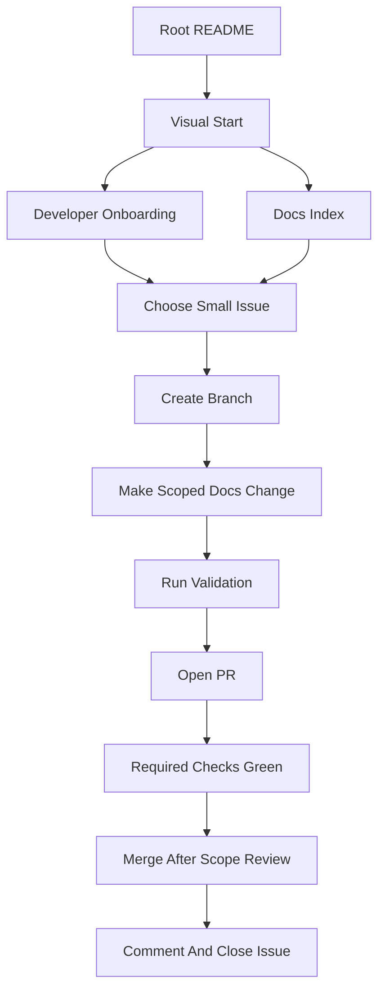
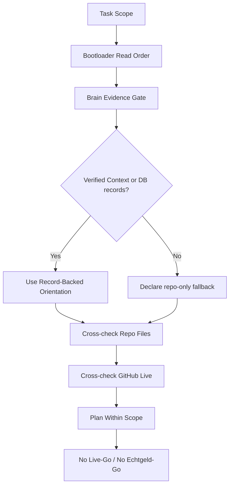

# CDB Developer Visual Start Here

Status: Orientation
Issue: #3238
Scope: Developer onboarding, examples, templates, and visual docs only

## What Is CDB?

Claire de Binare (CDB) is a deterministic, governance-first trading-system repo.
The working repo is the active canon for code, docs, governance, agent bootloader,
and Context Intelligence navigation. The active development posture stays
shadow/paper-first: `trade-capable` is Board context, not Live-Go.

Docs/UI sind Orientierung, keine Autoritaet. The canonical sources remain the
repo files and GitHub live state named by the bootloader, governance docs, and
status surfaces.

## Start Path For New Developers

Use this path when you have a fresh checkout and need a human-friendly overview
before touching implementation work.

1. Read the root landing page: [`../../README.md`](../../README.md).
2. Read the shortest docs index: [`../index.md`](../index.md).
3. Read the developer setup guide: [`../../DEVELOPER_ONBOARDING.md`](../../DEVELOPER_ONBOARDING.md).
4. Read service, test, and tool indexes when they match your task:
   [`../../services/README.md`](../../services/README.md),
   [`../../tests/README.md`](../../tests/README.md),
   [`../../tools/README.md`](../../tools/README.md).
5. Use the examples in [`examples/README.md`](examples/README.md) before drafting
   your first issue-to-PR workflow.
6. Use the templates in [`templates/`](templates/) for prompts, evidence docs,
   and docs/onboarding PR bodies.

## Start Path For Agents

Use this path when the actor is an AI coding agent or a human preparing an
agent prompt.

1. Resolve the bootloader: [`../../AGENTS.md`](../../AGENTS.md) ->
   [`../../agents/AGENTS.md`](../../agents/AGENTS.md) ->
   [`../../agents/OPEN_CODE_AGENTS.md`](../../agents/OPEN_CODE_AGENTS.md).
2. Read the full Read Order from `agents/AGENTS.md` before planning.
3. If scope includes Context, SurrealDB, MCP, DB-backed memory, or evidence,
   output the Brain Evidence block before the plan.
4. Prefer verified Context/MCP evidence when available; otherwise declare
   `brain_source=repo-only` and use repo/GitHub live cross-checks.
5. For issue work, verify GitHub live state before writing.
6. Respect the single-writer lock and issue/PR comments required by
   `CDB_AGENT_POLICY.md` section 4.

## Safety And LR Boundaries

- LR bleibt NO-GO.
- Board stage `trade-capable` is not Live-Go.
- No Echtgeld-Go.
- No real GUI, web app, Streamlit, Grafana, React, Vite, screenshots, or runtime
  surface is created by this pack.
- No Docker, runtime, service, strategy, risk, execution, trading, LR, productive
  DB, or memory-write change is included.
- `CURRENT_STATUS.md` is a repo/engineering ledger, not GitHub live truth.
- GitHub live and repo live evidence win over Brain, memory, or ledger claims.

## Developer Onboarding Flow

Mermaid source: [`diagrams/cdb_developer_flow.mmd`](diagrams/cdb_developer_flow.mmd).

## Repo Brain / Context Intelligence Flow

Mermaid source: [`diagrams/cdb_repo_brain_flow.mmd`](diagrams/cdb_repo_brain_flow.mmd).

## Examples And Templates

- Examples index: [`examples/README.md`](examples/README.md)
- First issue-to-PR flow: [`examples/first_issue_to_pr_flow.md`](examples/first_issue_to_pr_flow.md)
- First Repo Brain / Context use: [`examples/repo_brain_first_use.md`](examples/repo_brain_first_use.md)
- Agent prompt template: [`templates/agent_prompt_template.md`](templates/agent_prompt_template.md)
- Evidence doc template: [`templates/evidence_doc_template.md`](templates/evidence_doc_template.md)
- PR body template: [`templates/pr_body_template.md`](templates/pr_body_template.md)

## Authority Boundary

This pack is a developer-facing start surface. It does not replace:

- Governance canon under `knowledge/governance/`
- The agent bootloader in `AGENTS.md` and `agents/AGENTS.md`
- GitHub live issue/PR state
- `docs/live-readiness/LR-AUDIT-STATUS-2026-03-05.md` for Echtgeld Go/No-Go
- `docs/runbooks/CONTROL_REGISTER.md` for Board stage and operating focus
