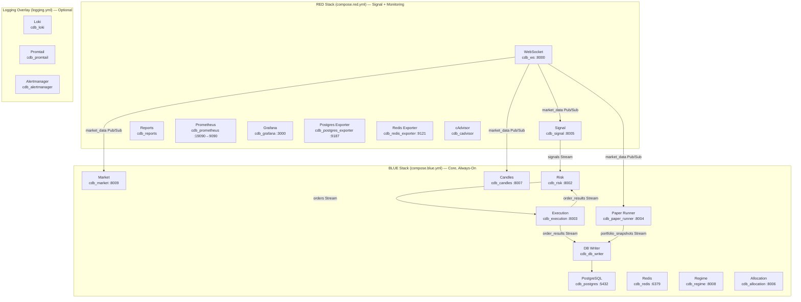

# BLUE/RED Runtime Topology

## Status

Docs-only onboarding artifact. Visual orientation — not authoritative.

## Parent / Issue Refs

- Parent: [#3253 Core-System Eventflow Map Pack](https://github.com/jannekbuengener/Claire_de_Binare/issues/3253)
- Issue: [#3255 Map BLUE/RED Runtime Topology](https://github.com/jannekbuengener/Claire_de_Binare/issues/3255)

## Purpose

Show the BLUE/RED stack split that structures CDB's Docker Compose deployment. BLUE is the always-on core trading layer; RED is the signal-generation and monitoring layer. Understanding this topology is essential for operators, developers, and anyone touching the runtime environment.

## Mermaid Diagram

See [`diagrams/blue_red_runtime_topology.mmd`](diagrams/blue_red_runtime_topology.mmd) for the source file.

## What New Developers Must Understand

1. **BLUE is the core.** It contains all trading-critical services: Market, Candles, Regime, Allocation, Risk, Execution, DB Writer, and Paper Runner. If BLUE is down, the system cannot function.
2. **RED is signal + observability.** WebSocket feeds market data in; Signal produces trading signals. Monitoring (Prometheus, Grafana, exporters) lives here. RED can fail without taking down BLUE's core pipeline.
3. **The Logging Overlay is optional.** Loki, Promtail, and Alertmanager are not part of the standard BLUE/RED start sequence. Activate them explicitly via `-f logging.yml`.
4. **`compose.blue.yml` and `compose.red.yml` are the canonical compose files.** Legacy files (`base.yml`, `dev.yml`, `tls.yml`) exist but are non-canonical.
5. **Healthy stack != Live-readiness.** The stack can be fully up and healthy while the system remains in LR NO-GO status.

## Source of Truth / Primary Repo Sources

- [`knowledge/ARCHITECTURE_MAP.md`](../../knowledge/ARCHITECTURE_MAP.md) — Full service map with ports and compose references
- [`infrastructure/compose/README.md`](../../infrastructure/compose/README.md) — Compose file documentation

## Safety Boundaries

- This diagram describes the **current deployment topology**, not a target architecture.
- The stack can be started and verified without any live-trading risk.
- No service in this topology can independently place a real trade.

## Non-Goals

- Not a Docker/docker-compose tutorial
- Not a capacity planning document
- Not a high-availability or disaster-recovery runbook

## Common Failure Modes / Onboarding Traps

| Trap | Reality |
|------|---------|
| Assuming RED must be up for BLUE to function | BLUE containers start without RED. Market data will not flow without cdb_ws, but core services remain available. |
| Confusing Logging Overlay as part of standard startup | Logging is optional. Start with `make docker-up` (BLUE+RED), add logging explicitly. |
| Reading healthy stack as readiness | All containers green does not mean the system is cleared for live trading. |

## LR NO-GO / Kein Live-Go / Kein Echtgeld-Go

LR remains NO-GO ([`docs/live-readiness/LR-AUDIT-STATUS-2026-03-05.md`](../../docs/live-readiness/LR-AUDIT-STATUS-2026-03-05.md)).
Board stage `trade-capable` is not Live-Go.
No Echtgeld-Go.
