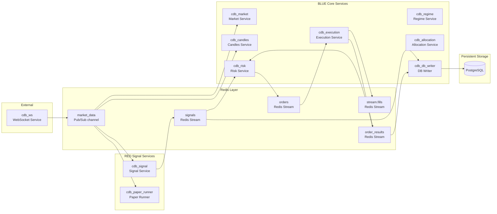

# Core Runtime Eventflow

## Status

Docs-only onboarding artifact. Visual orientation — not authoritative.

## Parent / Issue Refs

- Parent: [#3253 Core-System Eventflow Map Pack](https://github.com/jannekbuengener/Claire_de_Binare/issues/3253)
- Issue: [#3254 Map Core Runtime Eventflow](https://github.com/jannekbuengener/Claire_de_Binare/issues/3254)

## Purpose

Show the primary dataflow through CDB's runtime: from WebSocket market data ingestion through market, candles, signal, risk, execution, and finally persistence. This is the frame every developer needs before touching any runtime service.

## Mermaid Diagram

See [`diagrams/core_runtime_eventflow.mmd`](diagrams/core_runtime_eventflow.mmd) for the source file.

## What New Developers Must Understand

1. `market_data` is **Redis Pub/Sub** (not a Stream). It is a fire-and-forget broadcast channel. Services that miss a message will not replay it from this channel.
2. `signals`, `orders`, `allocation_decisions`, `stream.fills` are **Redis Streams** — durable, replayable logs. Consumers can read from any point.
3. `order_results` is feedback flow: execution results go back to Risk (for position/exposure tracking) and to DB Writer (for persistence).
4. The DB Writer is a **persistence consumer**, not a decision maker. It writes what it receives; it does not validate or block.
5. Allocation and Regime are supporting services — they provide context (position targets, market regime) to Risk but are not on the hot path.

## Source of Truth / Primary Repo Sources

- [`knowledge/ARCHITECTURE_MAP.md`](../../knowledge/ARCHITECTURE_MAP.md) — Service map, Redis channels, dataflows
- [`services/README.md`](../../services/README.md) — Redis transport semantics, service index

## Safety Boundaries

- This flow doc describes the **runtime as it exists today**. It does not propose changes.
- The system runs in **paper/mock mode by default**. Live exchange integration is gated.
- No service on this map can independently authorize a real trade. Every order passes through Risk.

## Non-Goals

- Not a deployment guide (see [`infrastructure/compose/README.md`](../../infrastructure/compose/README.md))
- Not a service implementation reference (see individual service READMEs under [`services/`](../../services/))
- Not a governance document (see [`knowledge/governance/`](../../knowledge/governance/))

## Common Failure Modes / Onboarding Traps

| Trap | Reality |
|------|---------|
| Treating `market_data` as a durable Stream | It is Pub/Sub — no replay. Subscribers must handle missed messages gracefully. |
| Expecting DB Writer to validate | It persists what it receives. Validation happens upstream in Risk/Signal. |
| Expecting direct service-to-service calls | All inter-service communication goes through Redis. Services are stateless and event-driven. |

## LR NO-GO / Kein Live-Go / Kein Echtgeld-Go

LR remains NO-GO ([`docs/live-readiness/LR-AUDIT-STATUS-2026-03-05.md`](../../docs/live-readiness/LR-AUDIT-STATUS-2026-03-05.md)).
Board stage `trade-capable` is not Live-Go.
No Echtgeld-Go.
