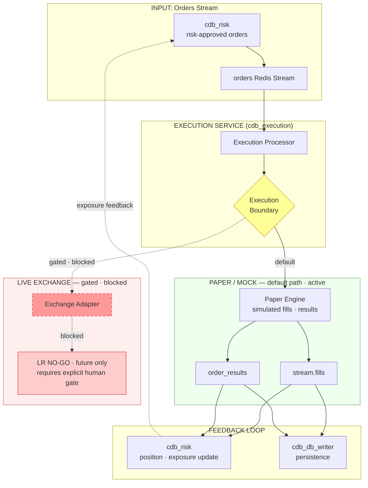

# Execution, Paper/Mock and Order Result Feedback

## Status

Docs-only onboarding artifact. Visual orientation — not authoritative.

## Parent / Issue Refs

- Parent: [#3253 Core-System Eventflow Map Pack](https://github.com/jannekbuengener/Claire_de_Binare/issues/3253)
- Issue: [#3258 Map Execution, Paper/Mock and Order Result Feedback](https://github.com/jannekbuengener/Claire_de_Binare/issues/3258)

## Purpose

Show how orders from Risk are processed by Execution, how the paper/mock boundary works, and how order results flow back to Risk and persistence. This is the path between a risk-approved order and a recorded fill.

## Mermaid Diagram

See [`diagrams/execution_paper_order_result_flow.mmd`](diagrams/execution_paper_order_result_flow.mmd) for the source file.

## What New Developers Must Understand

1. **Paper/Mock is the default mode.** Every order runs through paper/mock execution unless explicitly gated for live. This is not a config flag — it is a safety invariant.
2. **Execution does not authorize trades.** It receives risk-approved orders and processes them. It does not decide what to trade, how much, or whether to trade at all.
3. **Live/Exchange is a gated future boundary.** The live exchange adapter exists in code but requires explicit LR gate clearance and human approval. It is never the default path.
4. **Order results flow bidirectionally.** `order_results` and `stream.fills` update Risk (position tracking, exposure) and DB Writer (persistence) simultaneously.
5. **No order is final until it appears in `order_results`.** Execution may reject an order (e.g. invalid parameters, rate limits). Consumers must handle both fill and reject paths.

## Source of Truth / Primary Repo Sources

- [`services/execution/README.md`](../../services/execution/README.md) — Execution service documentation
- [`tools/paper_trading/README.md`](../../tools/paper_trading/README.md) — Paper runner documentation
- [`knowledge/ARCHITECTURE_MAP.md`](../../knowledge/ARCHITECTURE_MAP.md) — Channel map, invariants

## Safety Boundaries

- Execution is strictly a processor. It has no authority to generate orders or modify risk parameters.
- Paper/mock execution produces realistic fills but never touches a real exchange.
- Live exchange integration is gated by the LR process and requires explicit human GO.
- All order results are recorded in Redis Streams and PostgreSQL for full auditability.

## Non-Goals

- Not an order type reference
- Not an exchange adapter implementation guide
- Not a paper simulation accuracy analysis

## Common Failure Modes / Onboarding Traps

| Trap | Reality |
|------|---------|
| Assuming paper execution equals live execution | Paper fills have no slippage, latency, or liquidity constraints. Replay-vs-paper comparison exists precisely to quantify these gaps. |
| Expecting Execution to validate risk | Execution trusts that Risk has already validated the order. It processes what it receives. |
| Confusing paper runner with execution paper mode | Paper Runner (`tools/paper_trading/`) is a separate portfolio simulator. Execution's built-in paper mode is the default order processing path. |

## LR NO-GO / Kein Live-Go / Kein Echtgeld-Go

LR remains NO-GO ([`docs/live-readiness/LR-AUDIT-STATUS-2026-03-05.md`](../../docs/live-readiness/LR-AUDIT-STATUS-2026-03-05.md)).
Board stage `trade-capable` is not Live-Go.
No Echtgeld-Go.
