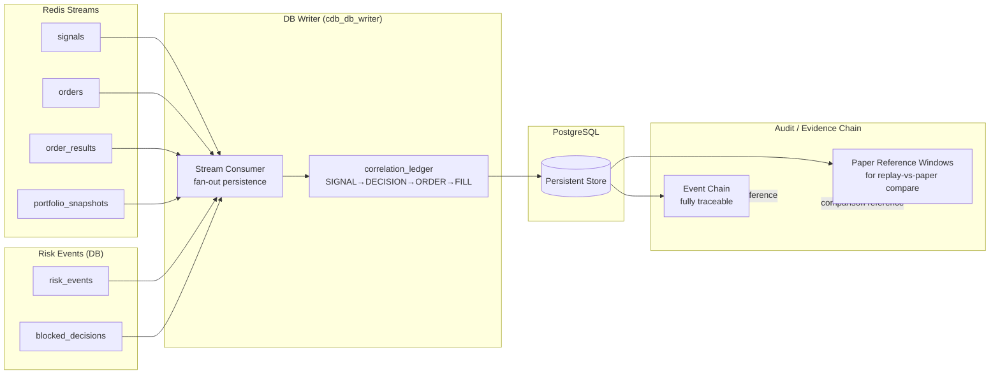

# Persistence and Correlation/Audit Event Chain

## Status

Docs-only onboarding artifact. Visual orientation — not authoritative.

## Parent / Issue Refs

- Parent: [#3253 Core-System Eventflow Map Pack](https://github.com/jannekbuengener/Claire_de_Binare/issues/3253)
- Issue: [#3259 Map Persistence and Correlation/Audit Event Chain](https://github.com/jannekbuengener/Claire_de_Binare/issues/3259)

## Purpose

Show how CDB persists all trading events and maintains a fully traceable audit chain. The `correlation_ledger` links every SIGNAL -> DECISION -> ORDER -> FILL into an append-only chain. This is the foundation for audit, replay-vs-paper comparison, and evidence-based validation.

## Mermaid Diagram

See [`diagrams/persistence_audit_chain_flow.mmd`](diagrams/persistence_audit_chain_flow.mmd) for the source file.

## What New Developers Must Understand

1. **Persistence is evidence, not approval.** Writing to PostgreSQL does not mean any action is approved. It means the event was recorded for audit, replay, or evidence purposes.
2. **The correlation_ledger is the audit spine.** Every trading-relevant event links back through the chain: a FILL references its ORDER, which references its DECISION, which references its SIGNAL. This chain is the foundation for all audit and comparison workflows.
3. **Paper Reference Windows enable replay-vs-paper comparison.** A `paper_reference_window` is a time-bound extract from the correlation_ledger that captures a paper trading session. Replay runs can be compared against these windows to quantify drift.
4. **risk_events and blocked_decisions are also persisted.** These are not just real-time signals — they are written to PostgreSQL for retrospective analysis and audit.
5. **The DB Writer is a passive consumer.** It writes what it receives from Redis Streams. It does not validate, filter, or enrich.

## Source of Truth / Primary Repo Sources

- [`knowledge/ARCHITECTURE_MAP.md`](../../knowledge/ARCHITECTURE_MAP.md) — PostgreSQL schema artefacts, correlation_ledger, blocked_decisions
- [`services/db_writer/README.md`](../../services/db_writer/README.md) — DB Writer service documentation
- [`infrastructure/database/migrations/`](../../infrastructure/database/migrations/) — Migration files for correlation_ledger (006_correlation_phase8c.sql) and risk_events (005_risk_events_idempotent.sql)

## Safety Boundaries

- The DB Writer has no write path to Redis Streams. It cannot inject events.
- The correlation_ledger is append-only. No deletion or modification of historical events.
- All persistence is in service of audit, replay, and evidence — never for trade authorization.

## Non-Goals

- Not a database schema reference
- Not a migration guide
- Not an audit compliance document

## Common Failure Modes / Onboarding Traps

| Trap | Reality |
|------|---------|
| Treating PostgreSQL as the system of decision | PostgreSQL stores what happened. It does not decide what should happen. |
| Expecting the correlation_ledger to be complete in real-time | There is a processing delay between a Stream event and its ledger entry. Query with appropriate time buffers. |
| Assuming paper_reference_window export includes all events | The export requires at least one ORDER with one FILL in the window. Empty windows are valid but produce no export. |

## LR NO-GO / Kein Live-Go / Kein Echtgeld-Go

LR remains NO-GO ([`docs/live-readiness/LR-AUDIT-STATUS-2026-03-05.md`](../../docs/live-readiness/LR-AUDIT-STATUS-2026-03-05.md)).
Board stage `trade-capable` is not Live-Go.
No Echtgeld-Go.
