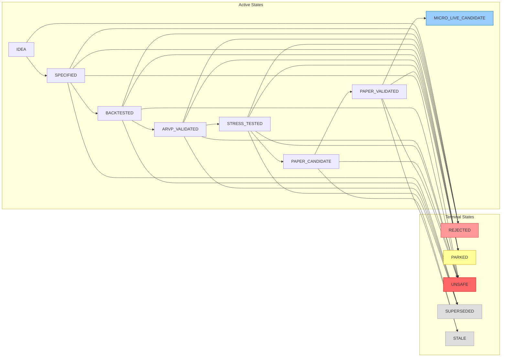

# Profitability Candidate Lifecycle and Evidence Gate Flow

## Status

Docs-only onboarding artifact. Visual orientation — not authoritative.

## Parent / Issue Refs

- Parent: [#3253 Core-System Eventflow Map Pack](https://github.com/jannekbuengener/Claire_de_Binare/issues/3253)
- Issue: [#3261 Map Profitability Candidate Lifecycle](https://github.com/jannekbuengener/Claire_de_Binare/issues/3261)
- Canon: [`CDB_PROFITABILITY_ENGINE_CANON.md`](../../docs/strategy/CDB_PROFITABILITY_ENGINE_CANON.md)

## Purpose

Show the full lifecycle of a profitability candidate through CDB's strategy pipeline: from raw IDEA through specification, backtesting, ARVP validation, stress testing, paper validation, and ultimately to micro-live candidate status. This is the path a strategy idea follows to become a candidate for real trading — with explicit gates, evidence requirements, and terminal states.

## Mermaid Diagram

See [`diagrams/profitability_candidate_lifecycle_flow.mmd`](diagrams/profitability_candidate_lifecycle_flow.mmd) for the source file.

## What New Developers Must Understand

1. **Candidate Factory creates candidates, not trades.** The lifecycle tracks strategy candidates through validation stages. It does not authorize trading. A candidate in any active state is still just a candidate.
2. **Net profitability matters.** Gross returns are not sufficient. Evidence must account for fees, spread, slippage, rejections, and latency before any promotion decision.
3. **The Strategy League Table recommends but does not authorize.** Ranking candidates by performance helps prioritize validation effort. It does not give any candidate the right to trade.
4. **Micro-Live requires separate LR gates.** Even PAPER_VALIDATED does not imply live readiness. MICRO_LIVE_CANDIDATE requires explicit LR gate clearance, human approval, and a cleared LR-SSOT.
5. **Terminal states are final.** REJECTED, PARKED, UNSAFE, SUPERSEDED, and STALE are endpoints. A candidate in these states is not on the active pipeline.

## Source of Truth / Primary Repo Sources

- [`docs/strategy/CDB_PROFITABILITY_ENGINE_CANON.md`](../../docs/strategy/CDB_PROFITABILITY_ENGINE_CANON.md) — Full lifecycle definition, gate matrix, evidence requirements
- [`knowledge/ARCHITECTURE_MAP.md`](../../knowledge/ARCHITECTURE_MAP.md) — Replay infrastructure underlying ARVP validation

## Safety Boundaries

- The Candidate Lifecycle is a governance framework, not a runtime system.
- No candidate lifecycle state change creates a financial instrument trade.
- MICRO_LIVE_CANDIDATE is the furthest state from raw IDEA — it requires passing through every validation gate.
- Terminal states (UNSAFE, REJECTED) are not reversible without a full re-evaluation.

## Non-Goals

- Not a template for candidate specification
- Not an evidence packet format reference
- Not a replacement for the Profitability Engine Canon

## Common Failure Modes / Onboarding Traps

| Trap | Reality |
|------|---------|
| Treating PAPER_VALIDATED as near-live | PAPER_VALIDATED is evidence-heavy but still requires Micro-Live gates. Paper success is not a predictor of live success. |
| Ignoring net economics | A candidate may look profitable on gross returns but fail after fees, spread, and slippage. Net calculation is mandatory at ARVP_VALIDATED and above. |
| Assuming promotion is automatic | Every state transition requires explicit evidence and gate review. No candidate promotes itself. |

## LR NO-GO / Kein Live-Go / Kein Echtgeld-Go

LR remains NO-GO ([`docs/live-readiness/LR-AUDIT-STATUS-2026-03-05.md`](../../docs/live-readiness/LR-AUDIT-STATUS-2026-03-05.md)).
Board stage `trade-capable` is not Live-Go.
No Echtgeld-Go.
