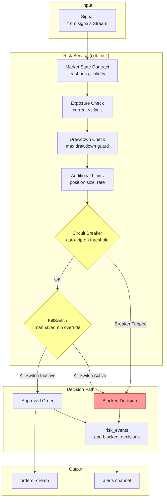

# Risk Gate, Circuit Breaker and KillSwitch Flow

## Status

Docs-only onboarding artifact. Visual orientation — not authoritative.

## Parent / Issue Refs

- Parent: [#3253 Core-System Eventflow Map Pack](https://github.com/jannekbuengener/Claire_de_Binare/issues/3253)
- Issue: [#3257 Map Risk Gate, Circuit Breaker and KillSwitch Flow](https://github.com/jannekbuengener/Claire_de_Binare/issues/3257)

## Purpose

Show how the Risk Service gates every signal before it becomes an order. This is the system's primary safety layer — it enforces exposure limits, drawdown caps, circuit breakers, and a manual kill switch. No trade happens without passing through Risk.

## Mermaid Diagram

See [`diagrams/risk_gate_flow.mmd`](diagrams/risk_gate_flow.mmd) for the source file.

## What New Developers Must Understand

1. **Risk gates every execution.** No signal bypasses Risk. A blocked decision is system protection, not a failure.
2. **Circuit Breaker is automatic.** It trips when configurable thresholds (e.g. consecutive losses, volatility spikes) are exceeded. Reset requires explicit intervention.
3. **KillSwitch is manual/admin.** An operator or automated admin can engage the KillSwitch to instantly block all order flow. It overrides all other checks.
4. **Blocked decisions are recorded.** Every blocked decision produces a `blocked_decisions` event and a `risk_events` entry. These are persisted for audit.
5. **No bypass possible.** Risk, KillSwitch, and LR gates cannot be circumvented by any service, agent, or operator shortcut.

## Source of Truth / Primary Repo Sources

- [`services/risk/README.md`](../../services/risk/README.md) — Risk service documentation
- [`knowledge/governance/CDB_AGENT_POLICY.md`](../../knowledge/governance/CDB_AGENT_POLICY.md) — Agent policy on risk gate compliance
- [`knowledge/ARCHITECTURE_MAP.md`](../../knowledge/ARCHITECTURE_MAP.md) — Risk events, blocked_decisions persistence

## Safety Boundaries

- Risk gating is fail-closed: if Risk cannot evaluate a signal, the signal is blocked.
- No order reaches Execution without an explicit `orders` Stream entry produced by Risk.
- Circuit Breaker and KillSwitch states are persisted and observable.

## Non-Goals

- Not a risk parameter tuning guide
- Not a specification for new risk checks
- Not an incident response runbook

## Common Failure Modes / Onboarding Traps

| Trap | Reality |
|------|---------|
| Assuming a passed risk check guarantees execution | Risk approval is necessary but not sufficient. Execution may reject or the KillSwitch may engage between check and order. |
| Treating blocked decisions as bugs | A blocked decision is the system working correctly. Investigate the reason before overriding. |
| Expecting to bypass Risk for testing | Risk gates are non-negotiable. All testing must respect the same gate path as production. |

## LR NO-GO / Kein Live-Go / Kein Echtgeld-Go

LR remains NO-GO ([`docs/live-readiness/LR-AUDIT-STATUS-2026-03-05.md`](../../docs/live-readiness/LR-AUDIT-STATUS-2026-03-05.md)).
Board stage `trade-capable` is not Live-Go.
No Echtgeld-Go.
