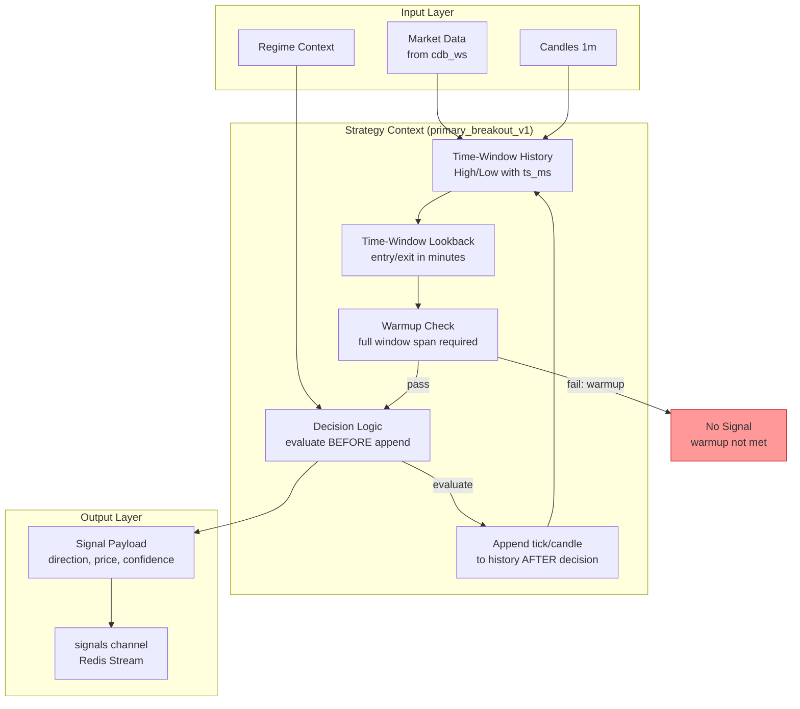

# Strategy Signal Decision Flow

## Status

Docs-only onboarding artifact. Visual orientation — not authoritative.

## Parent / Issue Refs

- Parent: [#3253 Core-System Eventflow Map Pack](https://github.com/jannekbuengener/Claire_de_Binare/issues/3253)
- Issue: [#3256 Map Strategy Signal Decision Flow](https://github.com/jannekbuengener/Claire_de_Binare/issues/3256)

## Purpose

Show how CDB's strategy engine (`primary_breakout_v1`) evaluates market data and produces signals. The signal decision flow is the boundary between raw market data and actionable trading decisions — but a signal is not a trade authorization.

## Mermaid Diagram

See [`diagrams/signal_decision_flow.mmd`](diagrams/signal_decision_flow.mmd) for the source file.

## What New Developers Must Understand

1. **Signal is not a trade authorization.** A signal on the `signals` channel must pass through Risk before any order is placed. A signal alone never produces a trade.
2. **Decision-before-append.** The strategy evaluates the signal **before** appending the current candle/tick to the time-window history. This prevents lookahead bias.
3. **Warmup semantics.** A signal is only generated when the time-window history covers the full lookback span. During warmup, no signals are produced. This is a common source of confusion when comparing replay vs paper results.
4. **Time-window lookback.** Entry and exit lookbacks are measured as time windows (minutes), not as event counts. This ensures deterministic behavior regardless of tick frequency.

## Source of Truth / Primary Repo Sources

- [`knowledge/ARCHITECTURE_MAP.md`](../../knowledge/ARCHITECTURE_MAP.md) — Signal lookback semantics, warmup validation
- [`services/signal/README.md`](../../services/signal/README.md) — Signal service implementation
- [`core/strategy/`](../../core/strategy/) — Strategy implementations

## Safety Boundaries

- Signal generation is pure computation over market data. It does not interact with Risk, Execution, or any trade path.
- No signal causes any financial instrument to be bought or sold.
- The `signals` channel is a durable Redis Stream — consumers can replay or catch up.

## Non-Goals

- Not a strategy design guide
- Not a specification for new strategy implementations
- Not a risk or trading document

## Common Failure Modes / Onboarding Traps

| Trap | Reality |
|------|---------|
| Assuming a signal means a trade will happen | Every signal passes through Risk, which can block it. Signal = proposal, not order. |
| Confusing lookback window semantics | Lookback is time-based (minutes), not count-based. A sparse-tick market may have fewer candles than expected. |
| Forgetting warmup in comparisons | Replay runs with full history may produce signals where paper-with-warmup did not. Always align warmup windows. |

## LR NO-GO / Kein Live-Go / Kein Echtgeld-Go

LR remains NO-GO ([`docs/live-readiness/LR-AUDIT-STATUS-2026-03-05.md`](../../docs/live-readiness/LR-AUDIT-STATUS-2026-03-05.md)).
Board stage `trade-capable` is not Live-Go.
No Echtgeld-Go.
