# GitHub Control Plane — Relationship Graph

**Repo:** Claire de Binare
**Canon date:** 2026-05 (generated for #1640)
**Source data:** #1633 workflow audit + #1644 manifest layer + live trigger scan

This document maps the dependency and coupling relationships across the `.github` control plane.

---

## 1. Workflow → Script Relationships

| Workflow | Script(s) | Notes |
|---|---|---|
| `cdb-daily-delta-triage.yml` | `scripts/daily_delta_triage.py` | Also reads `docs/runbooks/CONTROL_REGISTER.md` at runtime |
| `cdb-post-merge-followup-scanner.yml` | `scripts/post_merge_followup_scanner.py` | Shared prompt (see below) |
| `cdb-weekly-control-hygiene-classifier.yml` | `scripts/weekly_control_hygiene_classifier.py` | 3×/week schedule |
| `cdb-control-followup-classifier.yml` | `scripts/run_cdb_control_followup.sh` | Shell dispatcher, invokes prompt |
| `emoji-filter.yml` | `scripts/advanced-emoji-filter.py` | Config: `emoji-config.yaml` |
| `emoji-bot.yml` | `scripts/advanced-emoji-filter.py` | Same script, manual-only |
| `root-session-hygiene-warning.yml` | `scripts/root_session_hygiene_warn.py` | PR-only trigger |
| (collection-layer validator) | `scripts/control_plane_validate.py` | Not called by any workflow directly; runs via `tests/test_control_plane.py` and smoke scripts |

**Scripts with no current workflow caller (orphan risk):**
- `scripts/control_plane_validate.py` — called only by `tests/test_control_plane.py` and smoke scripts in `control-plane/test/`; no dedicated GitHub Actions workflow yet

---

## 2. Workflow → Prompt Relationships

| Workflow | Prompt |
|---|---|
| `cdb-control-followup-classifier.yml` | `prompts/cdb-control-followup.prompt.yml` |
| `cdb-post-merge-followup-scanner.yml` | `prompts/cdb-control-followup.prompt.yml` |

> **Shared surface:** `cdb-control-followup.prompt.yml` is consumed by **two different workflows**. Any change to this prompt affects both the post-merge scanner and the manual classifier. Test both before modifying.

---

## 3. Workflow → Command Relationships

| Workflow | Command file(s) |
|---|---|
| `gemini-invoke.yml` (reusable) | `commands/gemini-invoke.toml` |
| `gemini-review.yml` (reusable) | `commands/gemini-review.toml` |
| `gemini-triage.yml` (reusable) | `commands/gemini-triage.toml` |
| `gemini-scheduled-triage.yml` (parked) | `commands/gemini-scheduled-triage.toml` |

> `gemini-dispatch.yml` is the **sole public entry point** for the Gemini command family. The three reusable workflows (`invoke`, `review`, `triage`) have no independent trigger.

---

## 4. Workflow → Workflow Dependencies (workflow_run and workflow_call)

| Downstream | Upstream / Trigger source | Type |
|---|---|---|
| `weekly_digest_failure_alert.yml` | `weekly_digest.yml` | `workflow_run` |
| `auto-milestone-pr-apply.yml` | (upstream CI/merge workflow by name) | `workflow_run` |
| `gemini-invoke.yml` | `gemini-dispatch.yml` | `workflow_call` |
| `gemini-review.yml` | `gemini-dispatch.yml` | `workflow_call` |
| `gemini-triage.yml` | `gemini-dispatch.yml` | `workflow_call` |

> **Fragility note:** `workflow_run` triggers depend on the **exact name string** of the upstream workflow. If `weekly_digest.yml`'s `name:` field is changed, `weekly_digest_failure_alert.yml` silently stops firing. Same risk for `auto-milestone-pr-apply.yml`.

---

## 4a. Workflow → Issue Template Relationships

This section models the `workflow -> issue template` relationship in three explicit classes to avoid fake runtime edges.

**Runtime fact (repo scan):** no workflow YAML currently references `.github/ISSUE_TEMPLATE/*` directly.

| Coupling class | Repo-true status | Workflow side | Template side |
|---|---|---|---|
| **Direct runtime coupling** | **None at present** | No workflow reads template files at runtime | Templates are rendered by GitHub UI, not by workflow steps |
| **Governance/intake coupling** | **Present** | Issue-event flows consume issue labels/state created at intake (`issues` triggers like `auto-milestone*`, `project_status_*`, `triage_guard`, `add_to_project`; `control_board_auto_routing` was parked in #2772 and no longer fires on issue events) | Intake forms (`bug_report.yml`, `feature_request.yml`, `task.yml`, `live-readiness.yml`) pre-shape labels/scope and therefore downstream routing |
| **Policy/bookkeeping coupling (human gate)** | **Present** | Workflows do not enforce merge-gated closure/bookkeeping checklists by themselves | Governance-heavy templates (`standard.md`, `meta_cluster.md`, `meta_phase.md`, `meta_tracking.md`, `meta_governance.md`) define closure/bookkeeping expectations that operators apply during PR/issue handling |
| **No direct runtime relationship** | **Explicitly true for most non-issue workflows** | `push` / `pull_request` / `schedule` / `workflow_call` flows execute independently of template files | Templates do not alter those runtime paths unless issue metadata later enters workflow triggers |

**Fail-closed interpretation:** do not infer template-enforcement automation where no direct runtime edge exists. Treat template semantics as governance contract unless a workflow explicitly parses/enforces them.

---

## 5. Mermaid: Coupling Graph

```mermaid
graph TD
    subgraph "Scripts"
        S1[daily_delta_triage.py]
        S2[post_merge_followup_scanner.py]
        S3[weekly_control_hygiene_classifier.py]
        S4[run_cdb_control_followup.sh]
        S5[advanced-emoji-filter.py]
        S6[root_session_hygiene_warn.py]
        S7[control_plane_validate.py]
    end

    subgraph "Prompts"
        P1[cdb-control-followup.prompt.yml]
    end

    subgraph "Commands"
        C1[gemini-invoke.toml]
        C2[gemini-review.toml]
        C3[gemini-triage.toml]
    end

    subgraph "Output Surfaces"
        O1[Issue #1445 cockpit comment]
        O2[Bounded delta issues]
        O3[Follow-up issues/comments]
        O4[Hygiene issues]
        O5[Project board items]
        O6[Labels on issues/PRs]
        O7[Docker image registry]
        O8[CI pass/fail on PR]
        O9[Security scan report]
    end

    subgraph "Reporting/Control Workflows"
        WD[weekly_digest.yml]
        WDA[weekly_digest_failure_alert.yml]
        DDT[cdb-daily-delta-triage.yml]
        PMF[cdb-post-merge-followup-scanner.yml]
        WCH[cdb-weekly-control-hygiene-classifier.yml]
        CFC[cdb-control-followup-classifier.yml]
        TG[triage_guard.yml]
    end

    subgraph "AI/Spezialpfad Workflows"
        GD[gemini-dispatch.yml]
        GI[gemini-invoke.yml]
        GR[gemini-review.yml]
        GT[gemini-triage.yml]
        OC[opencode.yml]
        EF[emoji-filter.yml]
    end

    subgraph "CI/Quality Workflows"
        CI[ci.yml]
        PG[policy-gate.yml]
        DHG[docs-hub-guard.yml]
        GL[gitleaks.yml]
    end

    subgraph "Reconcile Workflows"
        SL[sync-labels.yml]
        CBU[control_board_upsert.yml]
        PRD[project_reconcile_daily.yml]
        CAR["control_board_auto_routing.yml<br/>(PARKED #2772)"]
    end

    %% Script connections
    DDT --> S1
    PMF --> S2
    WCH --> S3
    CFC --> S4
    EF --> S5
    WD -- workflow_run --> WDA

    %% Shared prompt
    S4 --> P1
    S2 --> P1

    %% Command connections
    GI --> C1
    GR --> C2
    GT --> C3

    %% Gemini call chain
    GD -- workflow_call --> GI
    GD -- workflow_call --> GR
    GD -- workflow_call --> GT

    %% Outputs
    WD --> O1
    DDT --> O2
    PMF --> O3
    WCH --> O4
    TG --> O3
    CBU --> O5
    PRD --> O5
    SL --> O6
    CI --> O8
    PG --> O8
    DHG --> O8
    GL --> O9

    %% Root file link
    SL -.->|reads| labels_json[labels.json]
```

> **Parking note (#2772, #2805):** `control_board_auto_routing.yml` (#2772) and `control-board-routing-label-dispatch.yml` (#2805) are parked. Their previous edges to `O5` (Project board items), `O6` (Labels on issues/PRs) and the dispatch chain between them are intentionally removed. The dispatch stubs do not call the routing script or `createDispatchEvent`.

---

## 6. Relationship Matrix

Full mapping across all support surfaces.

### Scripts consumed by multiple workflows

| Script | Workflows | Risk |
|---|---|---|
| `advanced-emoji-filter.py` | `emoji-filter.yml`, `emoji-bot.yml` | Low — both are emoji-scoped |
| `run_cdb_control_followup.sh` | `cdb-control-followup-classifier.yml` | Low — single consumer |

### Prompts consumed by multiple workflows

| Prompt | Workflows | Risk |
|---|---|---|
| `cdb-control-followup.prompt.yml` | `cdb-control-followup-classifier.yml`, `cdb-post-merge-followup-scanner.yml` | **Medium** — prompt change affects two independent operational flows |

### Labels.json consumed by multiple workflows

| File | Workflows | Risk |
|---|---|---|
| `workflows/labels.json` | `sync-labels.yml`, `label-bootstrap.yml` | Medium — label changes propagate to whole repo |

### Workflows sharing the same output surface

| Output surface | Workflows writing to it |
|---|---|
| Issue #1445 (cockpit comment) | `weekly_digest.yml` |
| Delta/control issues | `cdb-daily-delta-triage.yml`, `smart-insights.yml` |
| Hygiene issues | `cdb-weekly-control-hygiene-classifier.yml` |
| Follow-up issues/comments | `cdb-post-merge-followup-scanner.yml`, `cdb-control-followup-classifier.yml`, `triage_guard.yml` |
| Project board items | `control_board_upsert.yml`, `project_reconcile_daily.yml`, `add_to_project.yml` (`control_board_auto_routing.yml` was parked in #2772 and no longer writes to the project board) |
| Issue labels | `sync-labels.yml`, `auto-milestone.yml`, `auto-milestone-label-dispatch.yml`, `project_status_label_map.yml`, `milestone_stage_label_sync.yml`, `stale.yml`, `gemini-triage.yml` (`control_board_auto_routing.yml` was parked in #2772 and no longer labels issues; `control-board-routing-label-dispatch.yml` was parked in #2805 and no longer dispatches label events) |
| PR check status | `ci.yml`, `policy-gate.yml`, `docs-hub-guard.yml`, `gitleaks.yml` |

---

## 7. Isolated Workflows (no script, prompt, command, or workflow_run dependency)

These workflows are self-contained (no `.github/scripts/` or `.github/prompts/` dependency, no `workflow_run`/`workflow_call` chain):

| Workflow | Group |
|---|---|
| `sync-labels.yml` | Reconcile |
| `label-bootstrap.yml` | Reconcile |
| `auto-milestone.yml` | Reconcile |
| `auto-milestone-label-dispatch.yml` | Reconcile |
| `auto-milestone-pr-intent.yml` | Reconcile |
| `control_board_upsert.yml` | Reconcile |
| `project_reconcile_daily.yml` | Reconcile |
| `project_status_label_map.yml` | Reconcile |
| `project_status_sync.yml` | Reconcile |
| `add_to_project.yml` | Reconcile |
| `milestone_stage_label_sync.yml` | Reconcile |
| `control_board_auto_routing.yml` | Reconcile (PARKED #2772; dispatch stub only) |
| `control-board-routing-label-dispatch.yml` | Reconcile (PARKED #2805; dispatch stub only) |
| `ci.yml` | CI |
| `contracts.yml` | CI |
| `lr021_replay_smoke.yml` | CI |
| `python-compat.yml` | CI |
| `performance-monitor.yml` | CI |
| `e2e.yml` | CI |
| `e2e-tests.yml` | CI |
| `e2e-happy-path.yaml` | CI |
| `core-guard.yml` | CI |
| `shadow-soak-evidence.yml` | CI |
| `opencode.yml` | Spezialpfad |
| `mcp_runtime.yml` | Spezialpfad |
| `stale.yml` | Hygiene |
| `docs-hub-guard.yml` | Hygiene |
| `docs-conflict-guard.yml` | Hygiene |
| `copilot-housekeeping.yml` | Hygiene |
| `branch-policy.yml` | Hygiene |
| `required-checks-audit.yml` | Hygiene |
| `governance-audit.yml` | Audit |
| `ai-review-router.yml` | Audit |
| `smart-insights.yml` | Audit |
| `triage_guard.yml` | Reporting |
| `delivery-gate.yml` | Delivery |
| `docker-publish.yml` | Delivery |
| `copilot-setup-steps.yml` | Delivery |
| `gitleaks.yml` | Security |
| `trivy.yml` | Security |
| `security-scan.yml` | Security |
| `policy-gate.yml` | Audit |

---

## 8. Coupling and Drift Risk Callouts

### High coupling: shared prompt
`cdb-control-followup.prompt.yml` → 2 workflows. Any modification needs both workflows tested.

### High coupling: label event cascade
9+ workflows trigger on `issues: labeled`. A single unexpected label on an issue can fire a cascade. Monitor via #1445 cockpit.

### workflow_run name dependency (fragile)
`weekly_digest_failure_alert.yml` depends on the **exact name string** of `weekly_digest.yml`. If the workflow name changes, the failure alert silently breaks.

### Orphan: control_plane_validate.py
`control_plane_validate.py` has no dedicated GitHub Actions workflow. It runs only in `tests/test_control_plane.py` and local smoke scripts. Consider: a lightweight dispatch workflow to run the validator on `control-plane/` changes.

### Parked: gemini-scheduled-triage.yml
Schedule removed but YAML file remains. Should be annotated with `# PARKED` + date + reason to prevent accidental re-activation.

### Frozen: ci.yaml
Legacy copy of `ci.yml`. Coexists silently. Risk of accidental activation. Should be either deleted or annotated clearly.

### Scope overlap: issue-labeling legacy group
5 historisch workflows overlap with active Reconcile group. Collision risk if enabled. See Group 9 in Register.

---

## 9. Root-file relationship summary

| Root file | Consumed by / relationship |
|---|---|
| `CODEOWNERS` | GitHub enforces: all reviews require `@jannekbuengener` |
| `dependabot.yml` | GitHub reads: pip (Mon 04:00), actions (Mon 04:15), docker (Mon 04:30) |
| `pull_request_template.md` | GitHub renders: pre-populates all PR descriptions |
| `SECURITY.md` | GitHub renders: security policy; linked from `gh` security tab |
| `LABELS.md` | Human docs; canonical machine form is `labels.json` |
| `MILESTONES.md` | Human docs; no workflow reader |
| `emoji-config.yaml` | `emoji-filter.yml`, `emoji-bot.yml` |
| `workflows/labels.json` | `sync-labels.yml`, `label-bootstrap.yml` |

---

## 10. Cross-links

- `.github/README.md` — canonical entrypoint
- `docs/runbooks/GITHUB_CONTROL_PLANE_RUNBOOK.md` — how to read and debug workflows
- `docs/runbooks/GITHUB_WORKFLOW_REGISTER.md` — full 65-workflow register
- `docs/runbooks/GITHUB_CONTROL_PLANE_RUNBOOK.md` § "Issue templates as control-plane surface" — intake/policy depth
- `.github/control-plane/README.md` — manifest collection layer
- `docs/runbooks/CONTROL_REGISTER.md` — board stage, LR verdict, active infra list
